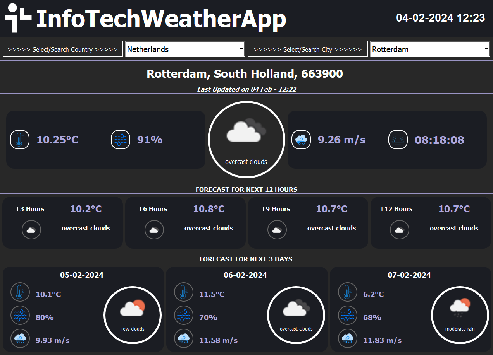

# InfoTech Weather Application (10-days challenge project)

## Project Overview
This project is a Weather Application with a graphical user interface designed to provide real-time weather information. This project is crafted over a period of 10 days. The application covers weather details for the Netherlands, Belgium, and the USA. The project utilizes PyQT5 for GUI, Scrapy for web scraping city data, HTTP-Request and API for real-time weather data, and MongoDB for efficient data storage.

### Features
- **Country Selection:** Upon starting the application, users are prompted to select a country.
- **Province/Region Listing:** Post country selection, provinces or regions within the selected country are listed, sorted based on population.
- **Detailed Weather Information:** For the chosen province or region, the application displays:
  - The name of the province/region
  - The state it belongs to
  - The population
  - Current weather (represented as an icon)
  - Temperature
- **City Search Functionality:** Users can search for a city to view its information and current weather conditions.

## Tools and Technologies

- **Python 3.10.11:** Main programming language.
- **PyQt5 Designer 5.14.1:** For designing the Graphical User Interface (GUI) components.
- **Trello:** For task management and Agile project tracking.
- **GitHub:** For version control and collaborative development.
- **pgAdmin 4 (7.8):** PostgreSQL database management tool.
- **dbdiagram.io:** For designing and documenting the database schema.
- **app.diagrams.net:** For creating UML diagrams.
- **Scrapy:** Web Scraping
- **Networking:** HTTP-Request and APIs for fetching real-time weather data
- **MongoDB:** Database Management System (DBMS)

## IDE
**Visual Studio Code:** Recommended IDE for development with support for Python and version control.

## Project Management
- Agile methodologies ensure that the project adapts to change quickly and efficiently.
- Regular meetings and use of Trello boards for task tracking and progress updates.

## Organized Meetings 
- **Project Kick-off / Sprint Planning Meeting:** 
- **Daily Scrum Meetings:** Every day
- **Retrospective Meeting / Sprint Planning Meeting
- **Sprint Review

## SPRINT-1
1. **Design GUI for App**
   - Consider Web Scraping Data Visualization
   - Consider Web API Data Visualization
2. **UML Diagrams and Database Structure**
   - Use Case Diagram
   - Class Diagram
   - MongoDB
3. **Scrapy**
   - Extract city, state, and population information from websites with Scrapy.
   - Display the name, region/state, and population of the selected city in the program.
   - Organize and store all information in the database.
   - Relevant URLs:
     - [US Cities by Population](https://en.wikipedia.org/wiki/List_of_United_States_cities_by_population)
     - [Municipalities of the Netherlands](https://en.wikipedia.org/wiki/Municipalities_of_the_Netherlands)
     - [Most Populous Municipalities in Belgium](https://en.wikipedia.org/wiki/List_of_most_populous_municipalities_in_Belgium)

## SPRINT-2
4. **HTTP Requests and API**
   - Use HTTP-Request and API to fetch real-time weather information.
   - Display temperature and weather icons for the selected cities, pulling data from [OpenWeatherMap API](https://openweathermap.org/api).
   - Store all information in the database.
   - [Weather Conditions and Icons](https://openweathermap.org/weather-conditions)
5. **Main Page Components**
   - Countries
   - Selected Country, Cities, Regions, Populations ordered by Population
   - City Search Bar
   - Selected City Name, Region, Population
   - Selected City Temperature (Celsius)
   - Selected City Weather Condition Icon (online from the given API) and icon Description
   - Selected City Humidity
   - Selected City Wind
   - Selected City 12-hour forecast every 3 hours
   - Selected City Next 3 days forecast

## Program/Output
- Generation of a “.EXE” file of the application to run on Windows.

## Installation
- Clone the repository:
git clone https://github.com/MERVEYILMZ/weather_app.git
cd weather_app
